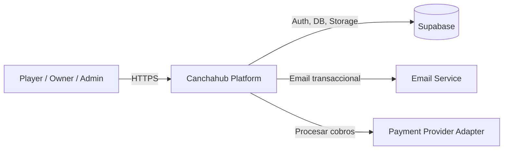
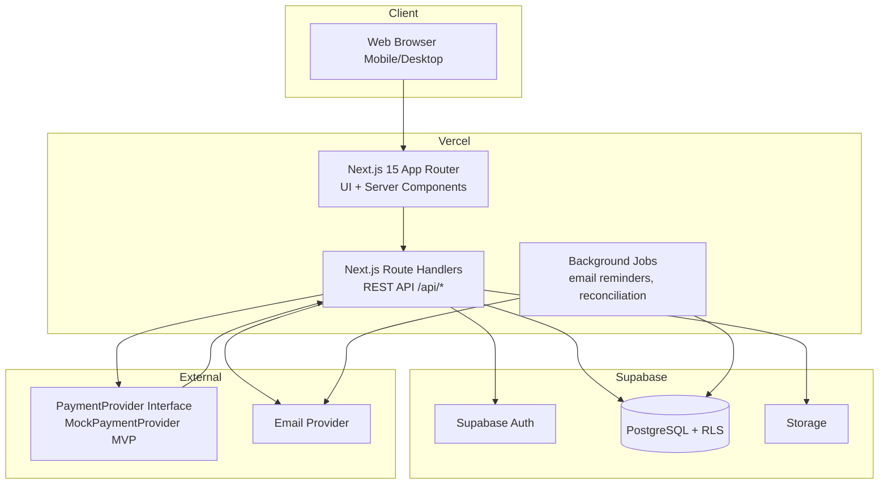
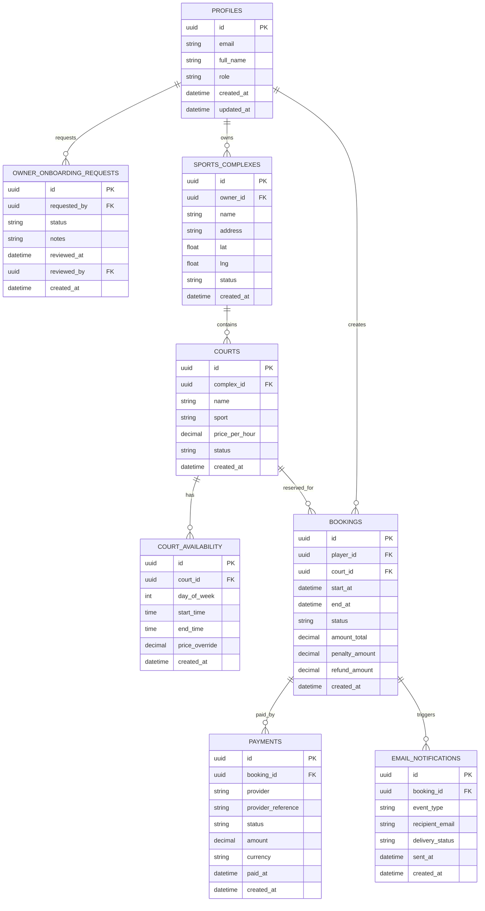
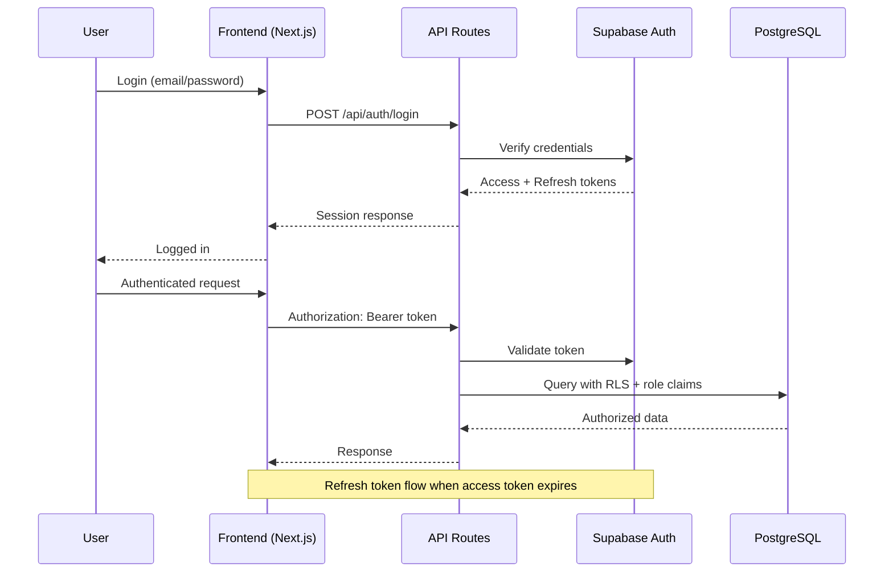

# Canchahub - Architecture Specifications (SRS)

## 1) System Architecture (C4 Level 1-2 en Mermaid)

### C4 Level 1 - System Context

### C4 Level 2 - Containers

## 2) Database Design (ERD en Mermaid)

> Importante: este ERD es conceptual para Fase 2. El schema SQL real se obtendra y validara en tiempo real via Supabase MCP en fases de implementacion. No se hardcodea SQL en este documento.

## 3) Tech Stack Justification

- **Frontend/Backend BFF: Next.js 15 (App Router + Route Handlers)**
  - ✅ Unifica frontend y API en un solo repo (menor complejidad MVP).
  - ✅ Buen performance con Server Components y streaming.
  - ✅ Despliegue nativo en Vercel con buena DX.
  - ❌ Trade-off: App Router exige disciplina en boundaries server/client.

- **Database/Auth: Supabase (PostgreSQL + Auth + RLS)**
  - ✅ PostgreSQL maduro para transacciones de reserva/pago.
  - ✅ Auth integrado acelera time-to-market.
  - ✅ RLS habilita aislamiento por rol/tenancy.
  - ❌ Trade-off: requiere diseno cuidadoso de politicas RLS para no romper flujos.

- **Hosting: Vercel**
  - ✅ Deploy continuo simple desde GitHub.
  - ✅ Escalado serverless adecuado para MVP.
  - ✅ CDN y edge caching integrados.
  - ❌ Trade-off: costos pueden crecer con alto volumen de ejecuciones.

- **CI/CD: GitHub Actions**
  - ✅ Pipeline estandar (lint, test, build) con trazabilidad por PR.
  - ✅ Facil integracion con checks de calidad.
  - ✅ Automatiza releases por branch strategy.
  - ❌ Trade-off: mantener pipelines bien optimizados consume tiempo inicial.

- **Pagos: PaymentProvider Adapter + MockPaymentProvider (MVP)**
  - ✅ Evita lock-in temprano a pasarela no definida.
  - ✅ Permite desarrollar dominio de pagos y reconciliacion desde ahora.
  - ✅ Facilita migracion a proveedor local boliviano en fase 3.
  - ❌ Trade-off: no valida todos los edge cases reales del proveedor final.

## 4) Data Flow (request -> response)

### Flujo tipico: Booking + Pago online

1. Player autenticado selecciona cancha y slot desde frontend.
2. Frontend llama `POST /api/bookings` con `court_id`, `start_at`, `end_at`.
3. API valida payload y autorizacion (`player`).
4. API verifica disponibilidad atomica y crea booking `pending_payment`.
5. Frontend llama `POST /api/payments` con `booking_id` y token de pago.
6. API invoca `PaymentProvider` (mock en MVP) y guarda transaccion.
7. Si pago `succeeded`, API cambia booking a `confirmed`.
8. Se dispara evento de email de confirmacion.
9. Frontend muestra comprobante y estado final.

### Flujo tipico: Cancelacion moderada

1. Player solicita cancelacion (`POST /api/bookings/{id}/cancel`).
2. API calcula ventana temporal respecto a `start_at`.
3. API aplica regla (100%, 50% o 0% reembolso) y actualiza montos.
4. Se crea evento de reembolso (si aplica) y email de cancelacion.
5. Frontend muestra resultado con penalidad/reembolso.

## 5) Security Architecture

### Auth Flow Diagram

### RBAC Implementation

- **Roles:** `player`, `owner`, `admin`.
- **Control en API:** middleware valida JWT + role antes de ejecutar handlers.
- **Control en BD (RLS):** politicas por tabla para aislar datos:
  - Player: solo sus reservas/pagos.
  - Owner: reservas y canchas de sus complejos.
  - Admin: acceso de gestion global.

### Data Protection

- Sanitizacion y validacion de input en frontend/backend.
- Proteccion de secretos en variables de entorno.
- TLS en todo trafico externo.
- Auditoria de acciones criticas (aprobaciones admin, cambios de estado de pago, cancelaciones).
